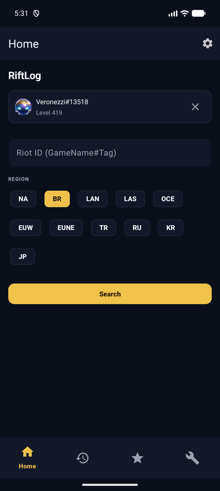
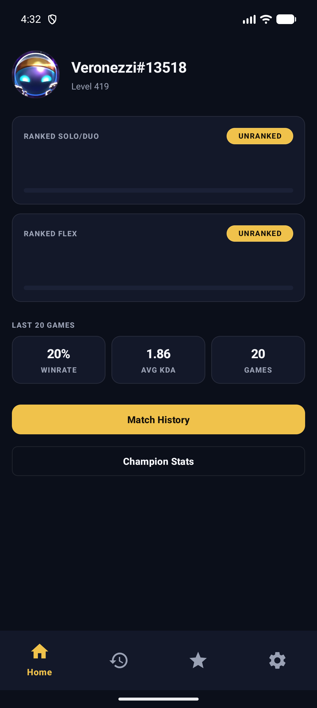
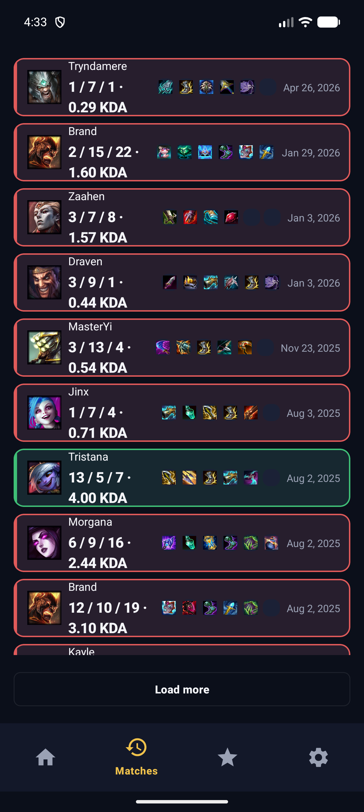
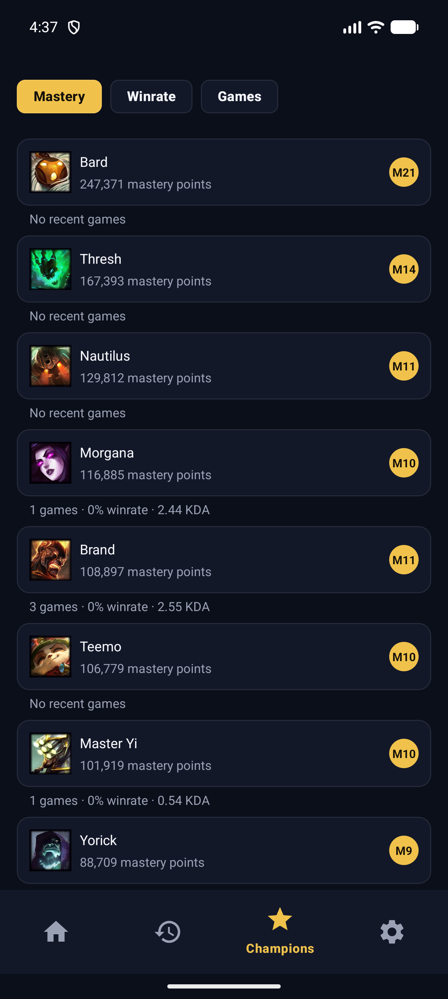
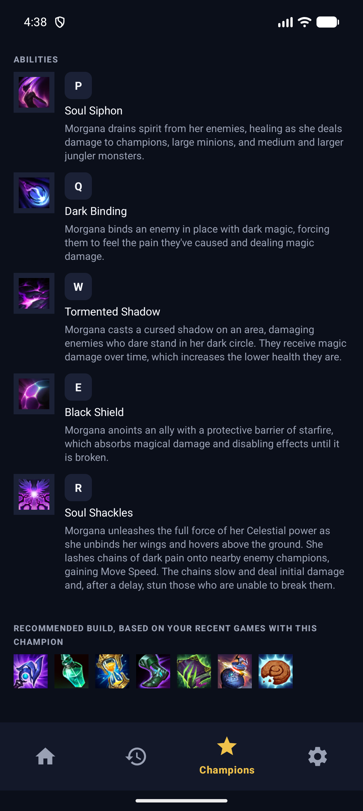
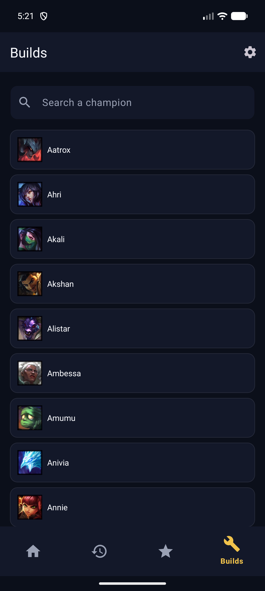
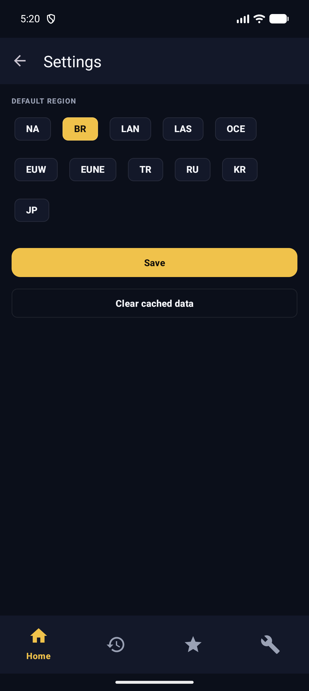

# RiftLog

A native Android League of Legends profile tracker: search a Riot ID, see rank, recent match
history, per-champion stats, champion kits, and item builds — both your own (derived from your
real recent games) and what professional players are actually buying right now.

Built with Kotlin + Views (no Compose) on top of the
[rift-tracker-design-system](https://github.com/veronezzi/rift-tracker-design-system).

## Screenshots

| Home | Profile | Match History |
|---|---|---|
|  |  |  |

| Champion Stats | Champion Detail | Builds |
|---|---|---|
|  |  |  |

| Settings |
|---|
|  |

## Features

- **Search any Riot ID** across all platform regions (NA, BR, EUW, KR, ...).
- **Pinned profile** — after your first search, your profile shows right on Home (avatar, name,
  level) with a one-tap remove.
- **Profile** — ranked Solo/Duo and Flex, winrate/KDA/games over your last 20 matches.
- **Match history** — full match list with champion, KDA, items, and a win/loss color tint per
  row.
- **Champion stats** — every champion you've played, sortable by mastery, winrate, or games,
  merged with real Riot mastery data.
- **Champion detail** — base stats, all 5 abilities (P/Q/W/E/R) with real descriptions, and two
  builds:
  - **Your build**, derived from your own recent games with that champion.
  - **Pro player build**, pulled from real, recent official esports matches via
    [Leaguepedia](https://lol.fandom.com)'s public API — not a fabricated "meta" guess.
- **Builds tab** — search and browse any of the ~170 champions, not just ones you've played.
- **Settings** — default region, clear cached data.

## Tech stack

- Kotlin, single-Activity + Navigation Component, ViewBinding (no Compose — the design system is
  XML/Views-based, so the app follows suit).
- Retrofit + kotlinx.serialization for the Riot Games API, Data Dragon (static champion/item
  data), and Leaguepedia's Cargo query API.
- A plain `SQLiteOpenHelper` for local caching (Room's KSP compiler doesn't yet work under this
  project's AGP 9 toolchain — see the comment in `RiftLogDbHelper`).
- Manual DI (`RiftLogApplication`, a handful of `by lazy` singletons) instead of Hilt/Dagger.
- Coil for image loading.

## Building it yourself

1. Get a Riot API key from the [Riot Developer Portal](https://developer.riotgames.com/) (a
   personal dev key works for testing, but expires every 24h and needs regenerating).
2. Add it to `local.properties` (gitignored, never committed):
   ```
   RIOT_API_KEY=RGAPI-your-key-here
   ```
3. `./gradlew assembleDebug`

No backend, no server-side secrets — the Riot key lives only in your local build, the same way a
Google Maps API key normally does in an Android project.

## Known limitations

- Riot's public API only covers ranked/normal games on visible accounts — professional
  tournament matches aren't included, which is why pro builds come from Leaguepedia instead.
- Leaguepedia's public API rate-limits aggressively per IP; pro builds are cached for 6 hours per
  champion to stay well under that and to survive a transient rate-limit hit gracefully.
- A personal Riot API key is rate-limited (20 req/s, 100 req/2min) and expires daily — fine for
  personal use, not meant for a distributed production app without a Riot-approved production
  key.

## Credits

Design system: [rift-tracker-design-system](https://github.com/veronezzi/rift-tracker-design-system)
by [@veronezzi](https://github.com/veronezzi).
